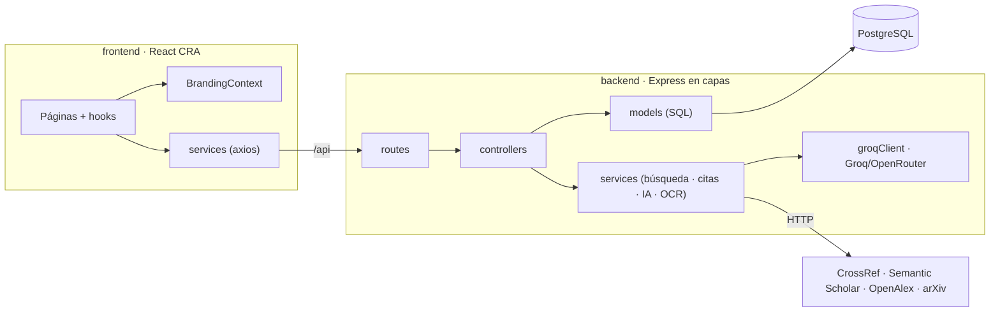

<p align="center">
  
</p>

<!-- ============================================================
     CITAE · README oficial
     ============================================================ -->

<div align="center">


# CITAE

### Plataforma académica todo-en-uno · descubre · lee · verifica · organiza · cita · comparte

<p>
  <a href="https://citae.ginit.dev"></a>
  
  
  
</p>

<p>
  
  
  
  
  
  
</p>

<p align="center">
  
</p>

</div>

---

## Tabla de contenidos

- [Qué es CITAE](#qué-es-citae)
- [Demo](#demo)
- [Características](#características)
- [Stack tecnológico](#stack-tecnológico)
- [Arquitectura](#arquitectura)
- [Estructura del proyecto](#estructura-del-proyecto)
- [Requisitos previos](#requisitos-previos)
- [Puesta en marcha](#puesta-en-marcha)
- [Variables de entorno](#variables-de-entorno)
- [Comandos](#comandos)
- [Tests y benchmark](#tests-y-benchmark)
- [Roles y administración](#roles-y-administración)
- [Despliegue](#despliegue)
- [Versionado](#versionado)
- [Autor](#autor)
- [Licencia](#licencia)

---

## Qué es CITAE

**CITAE** acompaña todo el ciclo de trabajo con literatura científica desde un único lugar:

<div align="center">

**descubrir → leer / resaltar → verificar → organizar → citar → compartir**

</div>

Busca un paper por **DOI, URL, título o subiendo el PDF**; CITAE consulta varias fuentes académicas a la vez, puntúa la relevancia de cada resultado, genera la cita en el formato que necesites, te deja resaltar el texto con significado académico y conversar con un asistente de IA sobre el contenido — **sin extensiones de navegador y sin suscripción**. El producto y todo el código están en **español**.

---

## Demo

<div align="center">

| | |
|---|---|
| **Producción** | <https://citae.ginit.dev> |
| **Estado** | En vivo · HTTPS · Nginx + systemd |
| **Base de datos** | PostgreSQL 17 |

</div>

---

## Características

| Área | Qué hace |
|------|----------|
| **Búsqueda** | Multi-fuente simultánea (CrossRef, Semantic Scholar, OpenAlex, arXiv) por DOI / URL / título, con *scoring* de relevancia, filtros en lenguaje natural (años, citas, tipo) y descubrimiento por autor. |
| **Citas** | 7 formatos al instante: APA, MLA, Chicago, Harvard, IEEE, Vancouver y BibTeX. Exportación de la biblioteca a BibTeX / RIS / CSV / Markdown. |
| **Lectura** | Resaltado semántico en 5 colores con notas, asistente de lectura con IA (*Trust Cards* con pasaje literal anti-alucinación), PDF completo y OCR de documentos e imágenes (es + en). |
| **Biblioteca** | Favoritos, colecciones y etiquetas (con *auto-tagging* por IA), búsqueda *full-text*, *heatmap* de actividad. Los papers resaltados entran solos a la biblioteca. |
| **Rigor** | *Claim Radar* (afirmación → fuentes que apoyan/contradicen), *Compare* (tabla comparativa de papers) y *Deep Research* (informe de literatura). |
| **Conocimiento** | RAG «Pregunta a tu biblioteca» (BM25), repaso espaciado (*Daily Review*) y *Quoteshots* compartibles. |
| **Social** | Colecciones y perfiles públicos (`/c/:slug`, `/u/:username`). |
| **Cuenta** | Email/contraseña (JWT) y Google OAuth (*state* firmado anti-CSRF). |
| **Admin** | Panel `/admin` para `super_admin`: *branding* dinámico (logo, colores, nombre) y gestión de usuarios (roles y activación). |
| **UI** | Tema claro/oscuro (oscuro en negro real), responsive con drawer en móvil, diseño *Academic Blue + Gold*. |

---

## Stack tecnológico

<div align="center">

**Lenguajes y librerías**

<p>
  
  
  
  
  
  
  
</p>

**Infraestructura y herramientas**

<p>
  
  
  
  
  
</p>

</div>

- **Frontend:** React (Create React App) + React Router. CSS plano por *design tokens* (sin Tailwind ni librerías de UI). Iconos SVG *inline*. SweetAlert2.
- **Backend:** Node.js + Express en capas. PostgreSQL (`pg`).
- **IA / LLM:** Groq (multi-key con *failover*) y OpenRouter como *fallback*, vía un único cliente (`groqClient`).
- **Documentos:** `pdf-parse` (PDF) y `tesseract.js` (OCR).
- **Tooling:** pnpm *workspace*, Jest.

---

## Arquitectura

Monorepo **pnpm** con dos paquetes que se comunican por una API REST.



**Backend — flujo estricto `routes → controllers → services / models`:**

- **`routes/`** — *endpoints*, `authMiddleware` y *rate limiting* por *feature*.
- **`controllers/`** — orquestan; **sin SQL directo**.
- **`models/`** — única capa con SQL. Los papers son **globales por DOI**; la biblioteca de un usuario = favoritos ∪ colecciones ∪ etiquetados ∪ **resaltados**.
- **`services/`** — lógica de dominio. Toda llamada a LLM pasa por un **único** cliente con *round-robin*, *failover* y *cooldown* por clave. Anti-SSRF en `utils/urlGuard.js`.

**Frontend:** estado por *hooks* (sin Redux); páginas pesadas con `React.lazy`; rutas públicas vs. protegidas (`/admin` exige `super_admin`); `BrandingContext` sobreescribe variables CSS en *runtime*.

> Detalle ampliado en **[ARCHITECTURE.md](ARCHITECTURE.md)**.

---

## Estructura del proyecto

```text
01.Soft_Citae/
├─ backend/                 @citae/backend — Express + PostgreSQL
│  ├─ src/
│  │  ├─ routes/            endpoints + rate limiting
│  │  ├─ controllers/       orquestación (sin SQL)
│  │  ├─ models/            única capa con SQL
│  │  ├─ services/          búsqueda, citas, IA, OCR, export…
│  │  ├─ middleware/        auth, errores
│  │  ├─ utils/             urlGuard (anti-SSRF), validadores
│  │  └─ config/            conexión a la base de datos
│  ├─ database/             schema base
│  ├─ migrations/           migraciones incrementales
│  ├─ benchmark/            rendimiento CPU-bound
│  ├─ __tests__/            tests (Jest)
│  ├─ server.js             arranque de Express
│  └─ migrate.js            schema + migraciones idempotentes
├─ frontend/                @citae/frontend — React CRA
│  ├─ public/
│  └─ src/
│     ├─ components/        UI por feature
│     ├─ hooks/             estado de la aplicación
│     ├─ services/          cliente de la API + utilidades
│     ├─ context/           BrandingContext
│     └─ styles/            tokens + CSS por componente
├─ pnpm-workspace.yaml
├─ ARCHITECTURE.md
├─ DEPLOY.md
└─ README.md
```

---

## Requisitos previos

| Requisito | Versión |
|-----------|---------|
| Node.js   | ≥ 18 |
| pnpm      | ≥ 9 (`npm i -g pnpm`) — gestor del *workspace*, no usar npm/yarn |
| PostgreSQL| ≥ 13 |

---

## Puesta en marcha

```bash
# 1. Instalar dependencias del workspace (backend + frontend)
pnpm install

# 2. Configurar variables de entorno
cp backend/.env.example backend/.env
#    edita backend/.env con tu BD, JWT_SECRET y (opcional) claves de IA / Google

# 3. Crear y migrar la base de datos
createdb citae          # o el nombre que pongas en DB_NAME
pnpm migrate

# 4. Arrancar en desarrollo
pnpm dev                 # backend (:5000) + frontend (:3000) en paralelo
```

- API: `http://localhost:5000`
- Web: `http://localhost:3000` (con *proxy* a la API)

En Windows también puedes usar `./start-local.ps1` (abre ambos servicios en ventanas separadas).

---

## Variables de entorno

Configura `backend/.env` a partir de [`backend/.env.example`](backend/.env.example):

| Variable | Descripción |
| -------- | ----------- |
| `DB_HOST` `DB_PORT` `DB_NAME` `DB_USER` `DB_PASSWORD` | Conexión a PostgreSQL (`DB_NAME` por defecto `citae`). |
| `JWT_SECRET` `JWT_EXPIRES_IN` | Firma y caducidad de los tokens JWT. |
| `GROQ_API_KEY` … `GROQ_API_KEY_5` `GROQ_MODEL` `GROQ_MODEL_FAST` | LLM de Groq (rotación multi-key; claves de cuentas distintas para más límite). |
| `OPENROUTER_API_KEY` `OPENROUTER_MODEL*` | *Fallback* de IA (opcional). |
| `GOOGLE_CLIENT_ID` `GOOGLE_CLIENT_SECRET` `GOOGLE_REDIRECT_URI` | Google OAuth (opcional). |
| `CLIENT_URL` `API_PUBLIC_URL` `PORT` | URLs del frontend / API y puerto del servidor. |

> El frontend usa API relativa (`/api`) por defecto en producción. Los secretos nunca se versionan (`.env` está en `.gitignore`).

---

## Comandos

| Comando | Descripción |
| ------- | ----------- |
| `pnpm install` | Instala backend + frontend (*workspace*). |
| `pnpm dev` | Backend y frontend en paralelo. |
| `pnpm dev:backend` | Solo la API → `http://localhost:5000` |
| `pnpm dev:frontend` | Solo la web → `http://localhost:3000` |
| `pnpm migrate` | Aplica el *schema* + migraciones idempotentes. |
| `pnpm build` | *Build* de producción del frontend. |
| `pnpm test` | Tests de todos los paquetes. |

---

## Tests y benchmark

```bash
pnpm test                                 # backend + frontend
pnpm --filter @citae/backend run test     # solo backend (Jest)
pnpm --filter @citae/frontend run test    # solo frontend (Jest / CRA)
pnpm --filter @citae/backend run bench    # benchmark CPU-bound
```

**109 tests** cubren las piezas puras y críticas: *matcher* de candidatos (ranking, *dedup*), los 7 formateadores de cita (backend y frontend), filtros en lenguaje natural, *guard* anti-SSRF, validadores, exportadores y utilidades del frontend.

---

## Roles y administración

| Rol | Acceso |
|-----|--------|
| `user` *(por defecto)* | Todas las funciones de la plataforma. |
| `super_admin` | Además el panel `/admin`: *branding* en *runtime* y gestión de usuarios (roles, activar/desactivar). |

El primer administrador se crea en la base de datos; luego un `super_admin` puede promover a otros desde el panel:

```sql
UPDATE users SET role = 'super_admin' WHERE email = 'correo@ejemplo.com';
```

El rol se lee fresco desde la base de datos en cada petición.

---

## Despliegue

CITAE corre en producción sobre un VPS Debian detrás de **Nginx**, con el backend como servicio **systemd** y el frontend servido como estáticos.

```bash
# Frontend (usa /api relativo por defecto)
pnpm --filter @citae/frontend run build
# subir frontend/build/* al directorio estático y borrar los *.map

# Backend
node migrate.js            # solo si hay migraciones nuevas
systemctl restart citae.service
```

Guía completa (Nginx, systemd, PostgreSQL, SSL con certbot, variables) en **[DEPLOY.md](DEPLOY.md)**.

---

## Versionado

Versionado semántico (`MAJOR.MINOR.PATCH`). Esta es la **primera versión oficial**. El flujo de trabajo, cómo subir cambios y cómo publicar una nueva versión están en **[CONTRIBUTING.md](CONTRIBUTING.md)**.

| Versión | Fecha | Notas |
|---------|-------|-------|
| **1.1.0** | 2026-07 | Claves de IA propias por usuario (BYOK): cada usuario puede añadir su clave de Groq, Google Gemini u OpenRouter. Se usa primero la suya y, si se agota, el servicio por defecto como respaldo. Claves cifradas en reposo. |
| **1.0.1** | 2026-07 | Limpieza de archivos sin uso, endurecimiento del límite de intentos de inicio de sesión y correcciones menores de interfaz. |
| **1.0.0** | 2026-06 | Versión oficial inicial: búsqueda multi-fuente, 7 formatos de cita, resaltado semántico + biblioteca, Reading Assistant IA, RAG, panel de administración (branding + usuarios), Google OAuth y despliegue en producción. |

---

## Autor

Desarrollado por **Richar Andre Vilca Solórzano** — Universidad Nacional del Altiplano (FINESI), Puno, Perú.

---

## Licencia

Proyecto **propietario** — todos los derechos reservados. El uso, copia o distribución requiere autorización expresa del autor.

<p align="center">
  
</p>
